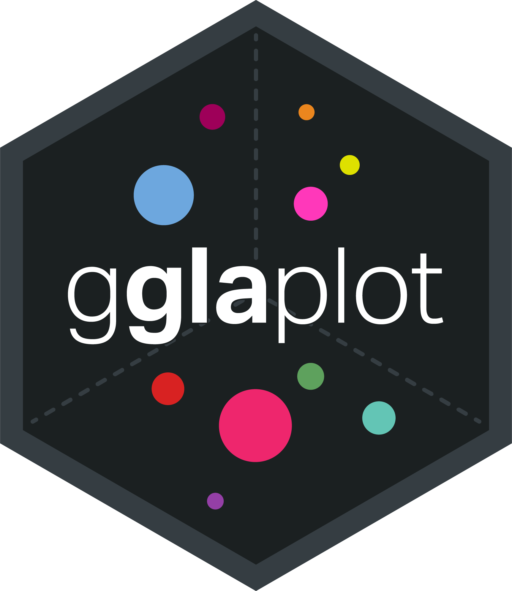
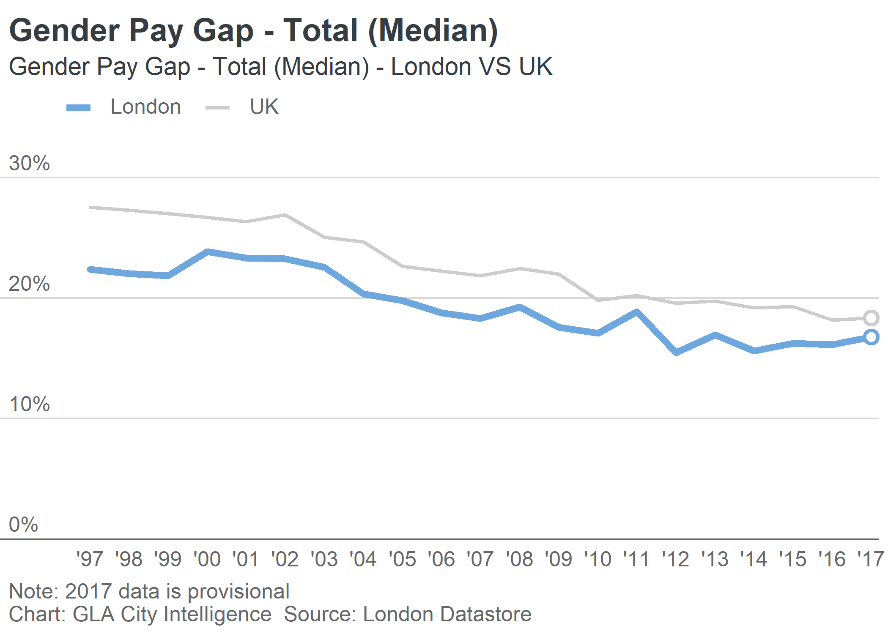

gglaplot 
============================================================================

The package provides several wrappers and tools to use with ggplot2 to make graphics that follow the GLA [City Intelligence Data Design Guidelines](https://data.london.gov.uk/blog/city-intelligence-data-design-guidelines/).

Installation
------------

``` r
# To install from github use the devtools function:
# This will install all required dependencies
devtools::install_github("Greater-London-Authority/gglaplot")
```

Usage
-----

``` r
library(ggplot2)
library(gglaplot)
library(dplyr)
library(scales)
library(lubridate)

pal <- gla_pal(gla_theme = "default", palette_type = "highlight", n = c(1, 1))
theme_set(theme_gla(gla_theme = "default"))

plot <- ggplot(data = LDNUK, mapping = aes(x = Year, y = GPG, group = location,
                                   colour = location)) +
  ggla_line(aes(size = location)) +
  scale_size_discrete(range = c(6 * mm_to_pt, 3 * mm_to_pt)) +
  scale_colour_manual(values = pal) +
  ggla_highlight(filter_type = "end") +
  ggla_axisat0() +
  scale_y_continuous(expand = c(0, 0), limits = c(0, 32.5),
                      labels = dollar_format(prefix = "", suffix = "%")) +
  scale_x_date(date_breaks = "1 year", date_labels = "'%y",
               expand = expand_scale(mult = c(0.05, 0.01))) +
  labs(title = "Gender Pay Gap - Total (Median)",
        subtitle = "Gender Pay Gap - Total (Median) - London VS UK",
        caption = "Note: 2017 data is provisional\nChart: GLA City Intelligence  Source: London Datastore")
plot
```



Plots can be incorporated in Rmarkdown/Notebooks or exported to be included in documents/slideshows etc

``` r
ggsave(plot = plot, path = "example_plot.svg")
```

`.svg` is the best format to export plots, and the size and dpi of the output can be adjusted within `ggsave()`.

Getting Help
------------

### ggplot2

There are many online resources for ggplot2, including:

-   [ggplot2 cheatsheet](https://ggplot2.tidyverse.org/)
-   [ggplot2 documentation](https://ggplot2.tidyverse.org/reference/)
-   [DataCamp course](https://www.datacamp.com/courses/data-visualization-with-ggplot2-1)

### gglaplot

For help with gglaplot itself, see the vignettes which are available on the [gglaplot github pages](https://greater-london-authority.github.io/gglaplot/).

The BBC has a similar package for their house style which has some comprehensive help pages [here](https://bbc.github.io/rcookbook/).
